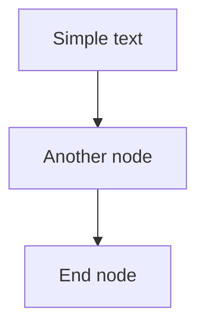

# Technical Blog Creator

This skill helps create comprehensive technical blog series based on existing codebase and documentation. It follows a structured process from content analysis to final blog generation, including handling user feedback and making necessary adjustments.

## When to Use

Invoke this skill when:

- User wants to create a technical blog series from existing codebase
- User needs to document a project through blog posts
- User asks to generate tutorials based on existing files
- User requests technical content creation from code examples
- User needs to structure technical knowledge into an organized blog series

## Process Overview

1. **Content Analysis** - Analyze existing files to understand the topic and key concepts
2. **Blog Planning** - Create a structured blog series plan with titles and topics
3. **Memory File Creation** - Establish a project-wide memory file for consistency
4. **Content Creation** - Generate individual blog posts with detailed content
5. **Enhancement** - Add tables, diagrams, and examples based on user feedback
6. **Revision** - Address user feedback and make necessary adjustments
7. **Finalization** - Review and optimize the complete blog series

## Step-by-Step Guide

### 1. Content Analysis

First, analyze the existing files to understand the topic and identify key concepts:

```python
from langchain_core.tools import tool

@tool
def analyze_content(file_path: str) -> str:
    """Analyze content of the specified file to understand the topic and key concepts"""
    # Read and analyze the file content
    # Identify main sections, code examples, and key concepts
    # Extract technical details and practical examples
    return "Analysis result with key concepts, structure, and technical details"
```

### 2. Blog Planning

Create a structured blog series plan based on the analysis, including titles and topics:

```python
@tool
def plan_blog_series(topic: str, key_concepts: list) -> str:
    """Create a structured blog series plan based on key concepts"""
    # Generate blog titles, summaries, and structure
    # Define the scope and depth of each blog post
    # Ensure logical progression between topics
    return "Blog series plan with titles, summaries, structure, and topic progression"
```

### 3. Memory File Creation

Establish a project-wide memory file to guide the blog creation process:

```python
@tool
def create_memory_file(project_name: str, blog_plan: str) -> str:
    """Create a project-wide memory file to guide the blog creation process"""
    # Generate structured memory file with blog series plan
    # Include guidelines for content creation and consistency
    # Add code example usage instructions
    return "Project-wide memory file with blog series guidelines"
```

### 4. Content Creation

Generate individual blog posts with detailed content, following the memory file guidelines:

```python
@tool
def create_blog_post(title: str, content: str, code_examples: list, memory_guideline: str) -> str:
    """Create a detailed blog post with the specified title and content"""
    # Generate blog post with introduction, body, code examples, and conclusion
    # Follow memory file guidelines for consistency
    # Include theoretical explanations and practical applications
    return "Complete blog post content with structured sections"
```

### 5. Enhancement

Enhance blog posts with tables, diagrams, and examples to improve readability:

```python
@tool
def enhance_blog_post(blog_content: str) -> str:
    """Enhance blog post with tables, diagrams, and additional examples"""
    # Add tables for comparisons and structured information
    # Add mermaid diagrams for visualization of concepts and architectures
    # Add additional examples and explanations to clarify complex topics
    # Ensure visual elements are properly formatted and readable
    return "Enhanced blog post content with tables, diagrams, and examples"
```

### 6. Revision

Address user feedback and make necessary adjustments to the blog posts:

```python
@tool
def revise_blog_post(blog_content: str, user_feedback: str) -> str:
    """Revise blog post based on user feedback"""
    # Fix syntax errors in diagrams or code examples
    # Adjust content structure based on user preferences
    # Split wide diagrams into smaller, more readable ones
    # Enhance explanations for complex topics
    return "Revised blog post content addressing user feedback"
```

### 7. Finalization

Review and optimize the final blog series for completeness and consistency:

```python
@tool
def finalize_blog_series(blog_posts: list, memory_file: str) -> str:
    """Review and optimize the final blog series"""
    # Check consistency across all blog posts
    # Ensure logical flow and progression between topics
    # Optimize for readability and technical accuracy
    # Verify all code examples are correctly referenced
    # Ensure visual elements are properly formatted
    return "Finalized blog series ready for publication"
```

## Best Practices

- **Content Quality** - Ensure accurate technical content based on the original files
- **Structure** - Create a logical flow with clear headings and sections
- **Examples** - Include relevant code examples from the original files
- **Visualization** - Use tables and diagrams to enhance understanding
- **Readability** - Balance technical depth with accessibility
- **Consistency** - Maintain consistent style and formatting across all blog posts
- **Feedback Integration** - Actively incorporate user feedback to improve content
- **Practicality** - Focus on practical applications and real-world scenarios

## Output Format

Each blog post should include:

- **Title** - An engaging and descriptive title
- **Summary** - A 100-word summary of key points
- **Introduction** - Overview of the topic and its importance
- **Body** - Detailed content with clear sections and subsections
- **Code Examples** - Relevant code from the original files with explanations
- **Tables** - Comparison tables and structured information for easy reference
- **Diagrams** - Mermaid diagrams for visualizing concepts and architectures
- **Practical Cases** - Real-world application examples
- **Application Scenarios** - Analysis of relevant use cases
- **Conclusion** - Key takeaways and next steps

## Directory Structure

技术博客/
└── [Blog Series Name]/
    ├── 1. [First Blog Post].md
    ├── 2. [Second Blog Post].md
    └── ...

## Mermaid Diagram Best Practices

### Mermaid 8.8.0 Known Limitations

|      Feature      | Issue                             | Solution                     |
| :---------------: | :-------------------------------- | :--------------------------- |
|     HTML tags     | `` causes parsing errors   | Use spaces or line breaks    |
|  Special Unicode  | Emojis (👤🧠⚡) may fail          | Use plain text descriptions  |
| Style definitions | `style` statements unsupported  | Remove style definitions     |
|  Complex quotes  | Nested quotes in brackets         | Simplify text content        |
| Colons in labels | `:` recognized as syntax marker | Use spaces instead of colons |

### Recommended Syntax



### Common Issues and Solutions

**Issue 1: Colons in node labels**

```markdown
<!-- Wrong -->
Step1[Step1: Decision] --> Step2

<!-- Correct -->
Step1[Step1 Decision] --> Step2
```

**Issue 2: Unconnected nodes in subgraph**

```markdown
<!-- Wrong -->
flowchart TB
    subgraph AgentSystem[Agent System]
        LLM[LLM]
        Tools[Tools]
    end
    LLM --> Tools

<!-- Correct -->
flowchart TB
    LLM[LLM] --> Tools[Tools]
```

**Issue 3: Dashed arrows**

```markdown
flowchart TD
    Step1[Step 1] --> Step2[Step 2]
    Step1 -.-> Detail1[Detail]
```

### Verification Checklist

Before submitting documents with Mermaid diagrams, check:

- [ ] Node labels do not contain colons `:`
- [ ] Node labels do not contain HTML tags
- [ ] Node labels do not contain emojis
- [ ] All nodes have proper connection relationships
- [ ] Avoid complex subgraph nesting
- [ ] Use standard ASCII characters

## Table Best Practices

### When to Use Tables

Convert list content to tables in the following scenarios:

|      Scenario      | Example                           |
| :----------------: | :-------------------------------- |
|  Summary sections  | Blog conclusion summaries         |
| Comparison content | Feature comparisons, pros/cons    |
|  Structured data  | Configuration parameters, options |
|  Multi-item lists  | More than 3 related items         |

### Table Format Standards

```markdown
| Column 1 | Column 2 |
|:---:|:---|
| Item 1 | Description 1 |
| Item 2 | Description 2 |
```

### Summary Section Table Template

```markdown
| Topic | Core Content |
|:---:|:---|
| **Theme 1** | Key point 1, Key point 2, Key point 3 |
| **Theme 2** | Key point 1, Key point 2 |
```

## Common Challenges and Solutions

### Challenge: Complex Diagrams

**Solution:** Split wide diagrams into multiple smaller, more readable diagrams

### Challenge: Technical Accuracy

**Solution:** Cross-reference with original codebase and documentation

### Challenge: Consistency Across Posts

**Solution:** Use a project-wide memory file for guidelines and reference

### Challenge: Balancing Depth and Accessibility

**Solution:** Include both theoretical explanations and practical examples

### Challenge: Mermaid Syntax Errors

**Solution:**

1. Remove all HTML tags (`<br/>`)
2. Remove emojis and special Unicode characters
3. Replace colons with spaces
4. Simplify complex subgraph structures
5. Test in Mermaid Live Editor before finalizing

This skill ensures that technical content is created in a structured, comprehensive, and engaging manner, making complex topics accessible to the target audience while maintaining technical accuracy and depth.

