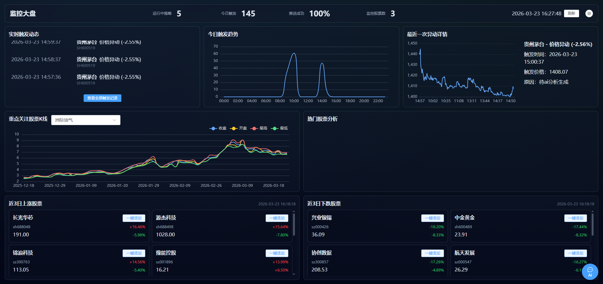
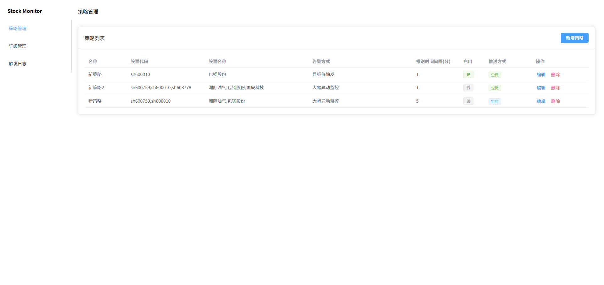
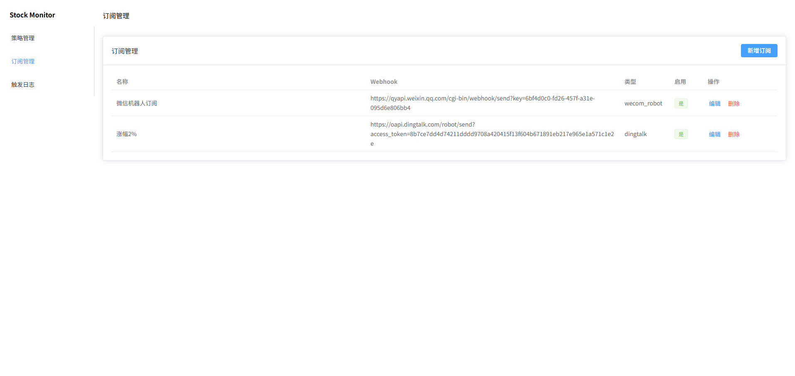
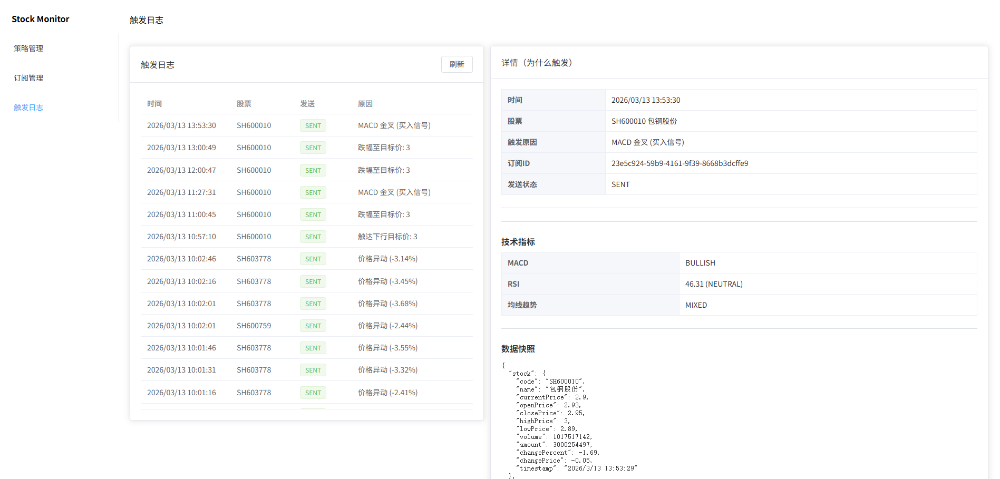
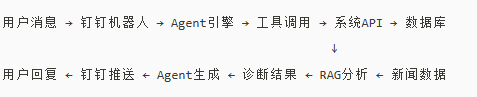

# 📈 智能股票量化监控WEB系统 (Smart Stock Quant Monitor)
一个基于 **Vue3 + Node.js + TypeScript** 的轻量级股票监控与推送系统。

由node工具迁入，功能更完善，新增WEB管理界面：
- node版本：https://github.com/BarnettNeo/stock-monitor

### 在线体验地址
- 地址：http://182.254.182.170/screen


项目由两部分组成：

- **server**：策略执行引擎 + REST API + 定时扫描 + 推送 + MySQL 持久化
- **admin**：Web 管理后台（策略/订阅/触发日志）

> 数据来自公开行情接口；系统输出仅供学习与技术交流，不构成投资建议。

### 智能监控AI agent - 升级版（开发中）：
- 地址：https://github.com/BarnettNeo/stock-monitor-agent

## 🚀 核心能力

- **策略管理**：新增/编辑/删除策略，配置监控股票与扫描间隔
- **告警方式二选一**：
  - **大幅异动监控（percent）**：按涨跌幅阈值触发
  - **目标价触发（target）**：按“涨幅至目标价 / 跌幅至目标价”触发（启用后会忽略涨跌幅阈值）
- **技术指标触发**：MACD / RSI / 均线趋势
- **形态信号**：突破回踩 / 破位反抽（由后端形态识别模块生成）
- **推送订阅**：支持钉钉机器人、企业微信机器人（以及企业微信应用预留类型）
- **触发日志**：记录每次触发原因、快照、发送状态与错误，便于回溯“为什么触发”
- **冷却机制**：同一策略对同一股票同一原因，在冷却时间内不重复推送

## 🛠️ 技术栈

| 模块 | 技术选型 | 说明 |
| --- | --- | --- |
| 前端后台 | Vue 3 + Vite + Element Plus | 管理端页面 |
| 后端服务 | Node.js + Express + TypeScript | REST API + scheduler |
| 数据库 | MySQL | 统一持久化存储，支持索引与并发访问 |
| 行情接口 | 新浪财经接口 | 批量报价、K线数据 |
| 指标计算 | technicalindicators | MACD/RSI/SMA |

## 📂 项目结构

```text
stock-monitor-web/
├── admin/                  # 管理后台（策略/订阅/触发日志）
├── server/                 # 后端服务（API + 扫描调度 + 推送 + DB）
├── src/                    # 旧版/实验代码（对照用，不影响 server/admin）
├── package.json
└── README.md
```

## ✅ 快速开始

### 1) 启动后端（server）

**先准备 MySQL**（后端依赖 `DB_*` 连接；若本机未装 MySQL，可用 Docker 一键启动，与默认 `.env` 一致）：

```bash
# 在项目根目录 stock-monitor-web/
docker compose -f docker-compose.mysql.yml up -d
```

然后：

```bash
cd server
yarn
yarn dev
```

默认地址：

- API：`http://localhost:3001/api/*`
- OpenAPI：`http://localhost:3001/openapi.json`
- Swagger UI：`http://localhost:3001/api-docs`

### 2) 启动前端（admin）

```bash
cd admin
yarn
yarn dev
```

访问：Vite 输出的本地地址（通常是 `http://localhost:5173`）。

## ⚙️ 配置与环境变量（server）

后端会读取项目根目录的 `.env`（`server/src/index.ts` 内通过相对路径加载）。常用参数：

- `PORT`：server 端口（默认 `3001`）
- `SCAN_INTERVAL_MS`：scheduler 全局扫描间隔（默认 `15000`）
- `DB_HOST` / `DB_PORT` / `DB_NAME` / `DB_USER` / `DB_PASSWORD`：MySQL 连接（Windows 上建议 `DB_HOST=127.0.0.1`，避免 `localhost` 解析到 `::1` 而本机 MySQL 未监听 IPv6）

若启动时报 `ECONNREFUSED 127.0.0.1:3306`，说明 **3306 上没有 MySQL 在监听**：请先启动本机 MySQL 或使用上面的 `docker-compose.mysql.yml`。

说明：

- **策略自己的 `intervalMs`** 是策略字段，用于策略配置与展示；
- **scheduler 的扫描频率** 由 `SCAN_INTERVAL_MS` 控制，每轮扫描会检查所有启用策略。

## 💾 数据存储与迁移

- 当前数据库：MySQL（连接配置使用根目录 `.env` 中 `DB_*` 变量）
- 后端启动时会自动执行 MySQL `CREATE TABLE IF NOT EXISTS` 初始化
- 若检测到旧数据文件 `server/data/db.sqlite`，后端会在首次启动时自动导入到 MySQL（一次性）

## 📊 策略说明

### 告警方式（二选一）

- **大幅异动监控（percent）**
  - 条件：`abs(changePercent) >= priceAlertPercent`
- **目标价触发（target）**
  - 条件：
    - `currentPrice >= targetPriceUp` → `涨幅至目标价: xxx`
    - `currentPrice <= targetPriceDown` → `跌幅至目标价: xxx`
  - 备注：启用目标价触发后，后端会忽略 `priceAlertPercent`（确保二选一）

### 技术指标（开关可控）

- **MACD 金叉**：趋势信号（买入倾向）
- **RSI 超卖/超买**：极值区间提醒
- **均线趋势**：多头排列（趋势偏多）

### 形态信号

- **突破回踩 / 破位反抽**：从近段 K 线价格序列检测形态信号

### 冷却机制

- 同一策略对同一股票 + 同一原因，在 `cooldownMinutes` 内不重复推送

## 📣 推送订阅（Subscriptions）

策略可绑定 0~N 个订阅：

- **绑定为空**：只记录触发日志，不推送
- **绑定多个**：对每个订阅分别发送并分别记录结果（便于看各渠道发送状态）

## 🧭 管理后台页面

- **策略管理**：配置股票、告警方式、指标开关、绑定订阅
- **订阅管理**：维护钉钉/企微等推送渠道
- **触发日志**：查看触发原因、快照、发送结果与错误

## 🖼️ 管理后台截图

建议把截图放在：`asstes/images/`（与仓库中现有图片保持一致）。

推荐命名：

- `admin-strategies.png`：策略管理
- `admin-subscriptions.png`：订阅管理
- `admin-trigger-logs.png`：触发日志

截图示例（将图片按上述命名放入目录后即可在 README 中展示）：

### 监控大屏 


### 策略管理



### 订阅管理



### 触发日志



## � 主要 API（简表）

- `GET /api/strategies`
- `GET /api/strategies/:id`
- `POST /api/strategies`
- `PUT /api/strategies/:id`
- `DELETE /api/strategies/:id`
- `GET /api/subscriptions`
- `POST /api/subscriptions`
- `GET /api/trigger-logs`

## 二阶段计划： 
- 当前项目分支：main-agent
- 地址：https://github.com/BarnettNeo/stock-monitor-web/tree/main-agent
- 数据流说明

### 1) AI agent核心引擎
- LLM大脑 (Qwen3)：理解用户意图，决策调用工具
- 工具库：策略管理、触发查询、诊断查看等8大工具
- 记忆系统 (Redis)：保存对话历史，实现上下文理解

### 2) RAG知识库
- 新闻采集器：实时抓取财经新闻
- 向量数据库 (ChromaDB)：存储和检索相关新闻
- AI分析引擎：异动归因分析，生成诊断报告


## 🧩 常见问题

### 1) 看不到“告警方式/目标价字段”？

- 重启 `server` 以执行数据库迁移（会自动补齐新字段）

### 2) 行情接口偶发失败/超时

- 公开接口存在波动，属于正常现象；可在日志中查看失败原因并重试

## ⚠️ 免责声明

本项目仅供技术交流与学习使用。所有行情数据来自公开互联网接口，系统生成的分析与推送不构成任何投资建议。
股市有风险，入市需谨慎；使用本软件产生的任何风险或损失需自行承担。
