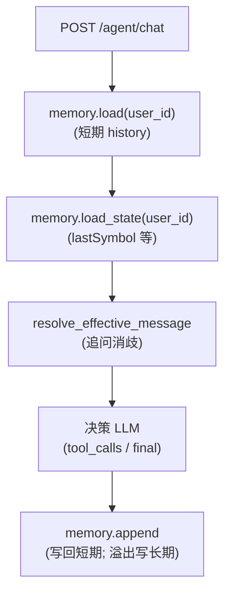
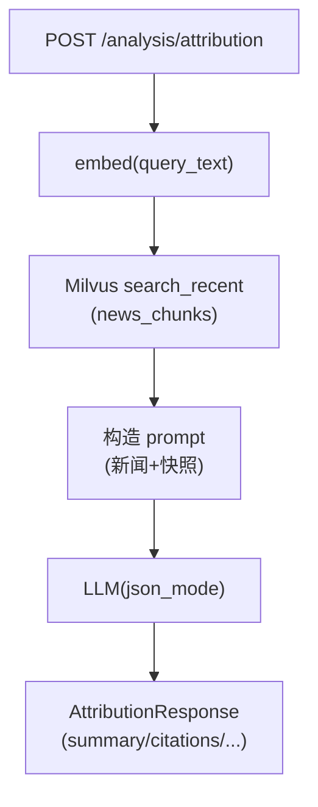

# Agents 记忆系统 & RAG 异动归因：实现说明

本文档基于当前仓库 `agents/` 目录下的实际代码，说明两块能力如何实现、各自提供哪些功能、以及它们在 API 层如何被调用：

- **记忆系统（Memory）**：短期对话缓存 + 轻量用户状态 + 长期向量记忆检索，用于“追问/上下文承接”的消歧与补全。
- **RAG 异动归因分析（Attribution RAG）**：对“异动原因”在近窗口新闻里做向量检索，结合快照信息交给 LLM 输出结构化归因结论与引用。

---

## 目录结构（关键文件）

- `agents/main.py`：FastAPI 服务入口；对外 API；聊天流程编排；调用记忆系统与 RAG 归因。
- `agents/infrastructure/memory.py`：记忆系统核心（Redis 短期 + Milvus 长期 + 内存兜底 + user state）。
- `agents/domain/context_memory.py`：追问上下文消歧（从显式 symbol / Redis 历史 / Milvus 长期记忆 / state 推断“你在说哪只股票”）。
- `agents/infrastructure/milvus_memory.py`：Milvus “长期聊天记忆”存储（`chat_memory` collection），按 `user_id` 分区检索。
- `agents/infrastructure/milvus_news.py`：Milvus “新闻向量库”检索（默认 `news_chunks` collection）。
- `agents/domain/attribution.py`：RAG 异动归因主逻辑（新闻检索 + LLM JSON 输出 + 引用整理 + 兜底）。
- `agents/llm/embeddings.py`：OpenAI-compatible embeddings 调用封装（用于 Redis 多候选消歧、长期记忆写入/检索、新闻检索）。
- `agents/llm/llm.py`：OpenAI-compatible Chat Completions 调用封装（支持 DashScope 兼容模式）；支持 `json_mode`。
- `agents/core/config.py`：环境变量、模型配置、系统提示词、工具规格等。

---

## 1) 记忆系统（Memory）如何实现

### 1.1 目标：让“追问”能承接上下文

典型追问：

- 用户上一句问了 `sh600519`，下一句只说“继续分析/为啥会涨/给个建议”，服务需要**推断它仍然在说 `sh600519`**。
- 历史对话太多时，短期缓存不足以覆盖，需要从长期向量记忆里“捞回来”相关片段辅助推断。

### 1.2 存储分层：Redis（短期） + Milvus（长期） + 内存兜底

在 `agents/infrastructure/memory.py` 中，`Memory` 类实现三层：

1. **短期记忆：Redis List**
   - key：`agents:history:{user_id}`
   - 值：每条消息 `json.dumps(...)` 后 rpush
   - 默认保留“最近 N 个 turn”（一个 turn≈用户+助手两条消息）
   - 当 Redis 可用时，`load()` / `append()` 优先走 Redis
2. **长期记忆：Milvus 向量库（可选）**
   - 当 Redis 列表超出短期上限时，**溢出的旧消息**会被 embedding 后写入 Milvus
   - collection 默认 `chat_memory`（可通过 `MILVUS_MEMORY_COLLECTION` 配置）
   - 检索按 `user_id` 过滤，向量相似度搜索返回 topK 片段
3. **兜底：进程内内存**
   - Redis 不可用时使用 `self._inmem` 保存最近消息，避免对话流程被打断

另外还有一块“轻量用户状态（state）”：

- key：`agents:state:{user_id}`
- 目前主要用于保存 `lastSymbol` / `lastStockName`（见 `agents/main.py` 中 `_update_state_from_message()`）
- 也是多层存储（Redis > 内存兜底）

### 1.3 写入流程：短期 append + 溢出写入长期

核心入口：`Memory.append(user_id, msg)`

- 永远 best-effort：任何异常都不会抛出到主流程（“必须不影响聊天”）。
- 写 Redis：`rpush` 后 `llen` 判断是否超限，超限则取出最旧 `cut` 条作为 `overflow`。
- `ltrim` 保留最后 `short_limit` 条，保证短期固定窗口。
- 若配置了 Milvus（`MILVUS_URI` 或 `MILVUS_HOST`），且有 overflow：
  - `_save_long_term()` 里调用 `llm.embeddings.embed_texts()` 得到向量
  - 调用 `milvus_memory.insert_messages(...)` 写入 collection

### 1.4 读取流程：短期 history + 长期 retrieve + state

- `Memory.load(user_id)`：读取最近短期对话消息列表（默认最多约 `MEMORY_SHORT_TURNS*2` 条）
- `Memory.retrieve_long_term(user_id, query, top_k)`：对 query 做 embedding 后去 Milvus 搜索相似历史片段
- `Memory.load_state(user_id)` / `save_state(user_id, state)`：读取/保存用户状态

### 1.5 追问消歧：resolve_effective_message（“你在说哪只股票？”）

位置：`agents/domain/context_memory.py`

`resolve_effective_message(...)` 的策略（按优先级）：

1. **显式 symbol**：当前消息里能抽到股票代码（`extract_symbols_from_text`）就直接使用
2. **Redis 短期历史**：反向扫描最近消息，收集候选 symbol
   - 若最近候选只出现 **1 个 distinct symbol**：直接认为追问指向它（`source=redis_unique`）
   - 若出现多个 symbol：使用 embedding 相似度在候选消息里做匹配（阈值 `0.35`，`source=redis_sim`）
3. **Milvus 长期记忆**：用当前消息做向量检索，统计 top hits 里出现频次最高的 symbol（`source=milvus`）
4. **state 提示**：最后使用 `state.lastSymbol`（`source=state_hint`）

输出是一个结构化对象（用于调试与解释）：

- `effective_message`：将推断结果以“括号说明”的形式拼回去，给后续决策 LLM / skill router 使用
- `resolved_symbol`：推断的股票代码
- `memory_snippets`：从 Milvus 检索出来的片段（最多 5 条）用于辅助 LLM 形成上下文（main.py 会注入 system message）
- `source`：推断来源（explicit/redis_unique/redis_sim/milvus/state_hint）

### 1.6 API 侧如何用记忆系统（聊天链路）

在 `agents/main.py` 的 `POST /agent/chat` 中（流程要点）：

1. `memory.load(user_id)` 取短期历史
2. `memory.load_state(user_id)` 取用户 state
3. `resolve_effective_message(...)` 做追问消歧，得到 `effective_message/resolved_symbol/memory_snippets`
4. `_update_state_from_message(...)` 更新 `lastSymbol/lastStockName`
5. 构造“决策消息”让 LLM 决定是直接回复还是要 tool_calls
   - 如果存在 `memory_snippets`，会以 system message 形式注入（“仅供参考”）
6. 助手最终 reply 写回短期记忆：`memory.append(user_id, {"role":"assistant","content": reply})`

### 1.7 关键环境变量（Memory 相关）

来自 `.env.example` 与代码中的实际读取点：

- `REDIS_URL`：启用 Redis 短期历史/用户状态
- `MEMORY_SHORT_TURNS`：短期保留 turn 数（默认 5）
- `MILVUS_URI` 或 `MILVUS_HOST` + `MILVUS_PORT`：启用 Milvus 长期记忆（以及新闻向量检索）
- `MILVUS_MEMORY_COLLECTION`：长期聊天记忆 collection（默认 `chat_memory`）
- `MILVUS_METRIC`：向量检索 metric（默认 `COSINE`）
- `EMBEDDING_BASE_URL` / `EMBEDDING_API_KEY` / `EMBEDDING_MODEL`：embeddings 调用；未设置时会复用 `LLM_BASE_URL/LLM_API_KEY`

---

## 2) RAG 异动归因分析如何实现

### 2.1 对外 API

在 `agents/main.py`：

- `POST /analysis/attribution`
  - 入参：`symbol / stockName / eventReason / snapshot / windowMinutes`
  - 出参：`summary / followUps / confidence / citations / meta`

该接口直接调用 `agents/domain/attribution.py: attribution_rag(...)`。

### 2.2 检索：在近窗口新闻里做向量搜索（Milvus）

位置：`agents/domain/attribution.py`

1. 将 `stock_name + symbol + event_reason` 拼成 query_text（`_build_query_text`）
2. 对 query_text 做 embedding：`embed_text(query_text)`
3. 调用 `milvus_news.search_recent(...)`
   - 默认 collection：`news_chunks`（`MILVUS_NEWS_COLLECTION`）
   - 搜索表达式（expr）包含：
     - `symbol == "{sym}"`
     - 以及可选的时间过滤：`ts >= since_unix_seconds`
   - 若 collection 不存在 `ts` 字段，会自动降级为“只按 symbol 过滤，不做时间过滤”

`agents/infrastructure/milvus_news.py` 负责 Milvus 连接与检索，并支持通过环境变量做字段映射：

- `MILVUS_NEWS_VECTOR_FIELD`（默认 `embedding`）
- `MILVUS_NEWS_TEXT_FIELD`（默认 `text`）
- `MILVUS_NEWS_TITLE_FIELD`（默认 `title`）
- `MILVUS_NEWS_URL_FIELD`（默认 `url`）
- `MILVUS_NEWS_SOURCE_FIELD`（默认 `source`）
- `MILVUS_NEWS_PUBLISHED_FIELD`（默认 `published_at`）

### 2.3 生成：LLM 输出 JSON 归因结论 + 引用

仍在 `agents/domain/attribution.py`：

- 将检索到的新闻片段格式化为 prompt（最多 8 条，整体字符数上限约 1200）
- 将触发快照 `snapshot`（截断到约 1200 字符）附带给 LLM
- 通过 `call_openai_compatible(..., json_mode=True)` 要求模型 **只输出 JSON**
- 使用 `extract_json_object(...)` 解析并做字段兜底：
  - summary 为空则输出“暂无明确新闻归因”
  - followUps 过滤空项并限制条数
  - citations 优先使用 LLM 输出；若 LLM 没给则使用检索阶段整理的 citations

如果 LLM 调用失败，会返回一个**稳定的兜底**（保证调用方链路不中断）：

- `summary`：提示 RAG/LLM 未就绪
- `followUps`：提供固定的后续关注点
- `citations`：仍尽量带上检索到的引用（如果有）
- `meta`：带上 Milvus 状态、embedding/llm 是否成功等诊断信息

### 2.4 需要的数据准备：news_chunks 如何写入？

当前 `agents/` 目录只实现了“检索与归因”，**不包含新闻抓取/清洗/入库**的完整流水线。

要让归因可用，需要你在 Milvus 中准备 `news_chunks`（或你自定义的 collection），并写入至少这些字段（推荐）：

- `symbol`：VarChar（用于 expr 过滤）
- `ts`：Int64 unix 秒（可选，但强烈建议，用于时间窗口过滤）
- `embedding`：FloatVector(dim)
- `text`：新闻正文/摘要片段
- 可选：`title / url / source / published_at`

---

## 3) 端到端调用链（推荐理解方式）

### 3.1 聊天：记忆驱动的追问承接

### 3.2 归因：新闻 RAG + JSON 输出

---

## 4) 常见问题与可扩展点（面向实现）

- **Redis 不可用怎么办？**：会自动退化到进程内内存（短期），但多实例/重启会丢上下文；建议生产务必接入 Redis。
- **Milvus 不可用怎么办？**：长期记忆与新闻 RAG 会退化（检索为空/写入跳过），聊天仍可跑；归因会走兜底 summary。
- **embedding/LLM 走同一个 base_url 可以吗？**：可以，`embeddings.py` 默认复用 `LLM_BASE_URL/LLM_API_KEY`，也可单独配置 `EMBEDDING_*`。
- **多股票追问怎么办？**：当前消歧默认只取一个 `resolved_symbol`（候选里取第一个/最优）；如果要支持“对比两只股票”，需要改写 `resolve_effective_message` 的输出协议与下游 prompt/skill 逻辑。

